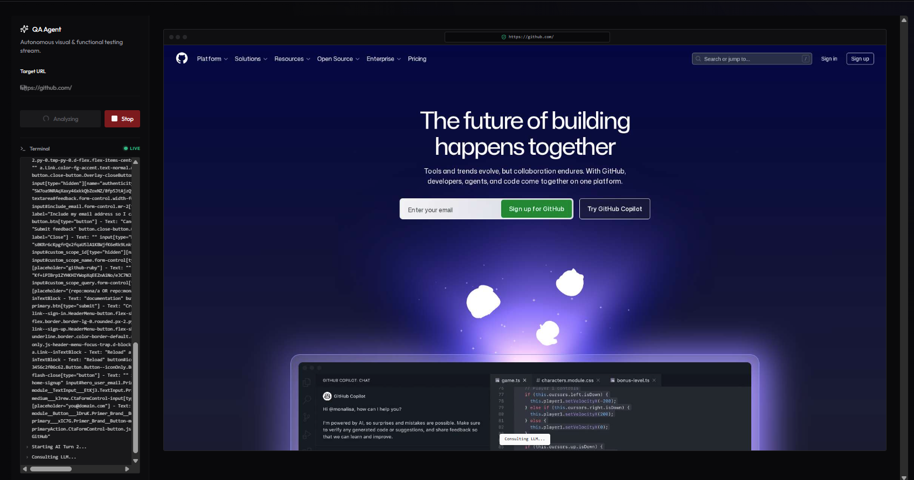

<div align="center">
  

  # QAgent

  **The Autonomous QA & Product Engineering Copilot**

  [](https://nextjs.org/)
  [](https://supabase.com/)
  [](https://developers.google.com/genkit/)
  [](https://playwright.dev/)
</div>

<br />

## Executive Summary

QAgent is an AI-powered Quality Assurance platform that bridges the gap between product requirements, manual testing, and automated E2E testing.

By leveraging **Google Gemini** (via the Genkit framework) and **Playwright**, QAgent:
- Intelligently navigates web applications for visual testing
- Translates product documents into structured Jira tickets
- Identifies visual and accessibility bugs autonomously
- Generates production-ready Playwright test scripts with zero manual overhead

---

## Target Audience

QAgent is built for modern, agile teams:

 Rapidly transition from manual test execution to automated script generation. Identify visual bugs, validate links, and verify accessibility compliance (WCAG) before code hits production Instantly convert PRDs and PDFs into ready-for-development Jira tickets


---

## Core Features

| Feature | Description | Status |
|---------|-------------|--------|
| **Visual AI Tester** | Autonomous agent that navigates your app, finds visual bugs, and interacts live | ✅ Live |
| **Document Importer** | Extracts requirements from PDFs/Word docs and generates Jira epics/stories | ✅ Live |
| **Playwright Generator** | Creates production-grade E2E test automation code from requirements | ✅ Live |
| **Bug Library** | Semantic search with pgvector for historical bug analysis | ✅ Live |

---

## Architecture

QAgent is split into two separate processes that communicate via HTTP and Supabase real-time events:

```
┌─────────────────┐     HTTP/WS      ┌──────────────────┐
│   Next.js App   │ ◄──────────────► │  Express Worker  │
│   (Port 3000)   │   (Port 3001)    │  (Port 3001)     │
└────────┬────────┘                  └────────┬─────────┘
         │                                    │
         │         Supabase Realtime          │
         └──────────────┬─────────────────────┘
                    Supabase
              (Postgres + Auth + Storage)
```

### Frontend (Next.js 15)
- **Framework**: Next.js 15 with App Router, React 18, TypeScript
- **UI**: Tailwind CSS v3 + Radix UI (Shadcn components)
- **State**: TanStack Query (React Query)
- **Auth**: Supabase Auth

### Worker (Express + Playwright)
- **Runtime**: Express.js with TypeScript
- **AI**: Genkit + Google Gemini models
- **Browser**: Playwright (Chromium)
- **Vector Embeddings**: Gemini embedding models

---

## Getting Started

### Prerequisites

- Node.js 18+ and npm
- Supabase account (free tier works)
- Gemini API key from [Google AI Studio](https://aistudio.google.com/)

### Installation

1. **Clone and install dependencies:**
```bash
git clone <repo-url>
cd qa-agent
npm install
cd worker && npm install && cd ..
```

2. **Configure environment:**
```bash
cp .env.example .env
```
Edit `.env` and fill in your Supabase and Gemini credentials. See `.env.example` for required variables.

3. **Set up Supabase:**
- Create a new project at [supabase.com](https://supabase.com)
- Enable the **pgvector** extension for semantic search
- Run migrations (see `supabase/migrations/` if available)

4. **Start the worker:**
```bash
cd worker
npx ts-node server.ts
```

5. **Start the frontend (new terminal):**
```bash
npm run dev
```

6. Open [http://localhost:3000](http://localhost:3000)

---

## Screenshots

> 📸 *Screenshots coming soon*

<!--

*The Visual AI Tester in action, navigating a web app autonomously*


*Converting PRDs into Jira tickets automatically*
-->

See the `/docs/screenshots/` directory for images

---

## Key Concepts

### Human-in-the-Loop
QAgent's Visual Tester includes an **approval layer**. When the AI encounters uncertainty, it pauses and asks for human input. This makes it collaborative, not black-box.

### Care over Speed
Features like semantic bug search and generated Playwright code are designed for **confidence**, not just speed. Indexes are built for accuracy, and data is validated.

### Private by Default
Google credentials, Jira tokens, and API keys are stored in your own Supabase Vault. QAgent is SaaS-friendly but data-sovereign.

---

## Tech Stack Deep Dive

| Category | Technology |
|----------|------------|
| **Framework** | Next.js 15 (App Router) |
| **Language** | TypeScript |
| **AI** | Genkit, Google Gemini (Flash, Gemma) |
| **Automation** | Playwright (Chromium) |
| **Backend** | Supabase (Postgres, Auth, Storage, PgVector) |
| **Styling** | Tailwind CSS, Radix UI |
| **State** | TanStack Query |
| **Testing** | Jest, React Testing Library |

---

## Project Structure

```
qa-agent/
├── src/
│   ├── app/                    # Next.js App Router
│   │   └── qa-test-assistant/  # Core features
│   │       ├── visual-tester/
│   │       ├── document-importer/
│   │       ├── playwright-generator/
│   │       └── bug-library/
│   ├── components/             # Reusable UI components
│   ├── lib/                    # Utilities, Supabase client, schemas
│   └── hooks/                  # Custom React hooks
├── worker/                     # Express/Playwright microservice
│   ├── server.ts               # Main worker entry
│   └── utils.ts                # Worker utilities
└── docs/                       # Documentation, screenshots
```

---

## Development Commands

```bash
# Frontend
dev                 # Start Next.js dev server on :3000
build               # Production build
start               # Production server
lint                # ESLint
test                # Run tests (Jest watch mode)

# Worker
cd worker && ts-node server.ts    # Start worker on :3001
```

---

## Deployment

### Railway (Worker)
1. Create a new Railway project
2. Connect your GitHub repo
3. Set the root directory to `worker/`
4. Add environment variables from `.env.example`
5. Deploy

### Vercel (Frontend)
1. Connect your GitHub repo to Vercel
2. Set framework preset to Next.js
3. Add environment variables
4. Deploy


---

 Built by [@danielfernandes202](https://github.com/danielfernandes202)
 Contribution by - [@MercySandra-r](https://github.com/MercySandra-r) and [@Pavithra2468](https://github.com/Pavithra2468)
